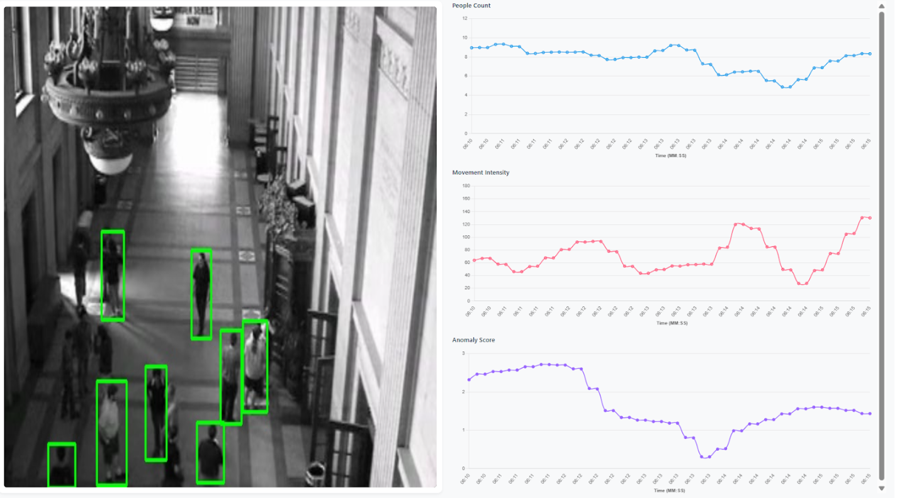

# Anomaly Detection using Crowd Behaviour Analysis

## Overview

The Crowd Detection System is a real-time, AI-powered solution designed to detect, analyze, and monitor crowd activity using computer vision techniques. Leveraging the YOLO (You Only Look Once) deep learning model, it processes video frames to identify people, track their movement, and detect anomalies in crowd behavior. The system includes a Python-based backend for analytics and a React web frontend for visualization.

---

## Features

- **Real-Time Crowd Detection:** Uses YOLOv8 for detecting and counting people in video frames.
- **Movement Analysis:** Tracks individual movement and calculates overall velocity (RMS) within the crowd.
- **Anomaly Detection:** Monitors crowd and velocity metrics to identify unusual activity using adaptive statistics and linear regression.
- **WebSocket Communication:** Enables live data and video streaming between client, server, and web UI.
- **User Interface:** React-based frontend for displaying real-time crowd statistics and alerts.

---

## Project Structure

```
crowd-detection/
├── client/
│   └── client.py            # Python script to send video frames to the server via WebSocket.
├── server/
│   ├── server.py            # Main backend logic for frame processing, detection, and anomaly analytics.
│   └── anomaly_monitor.py   # Utility for adaptive anomaly scoring and detection.
├── react-app/
│   ├── public/
│   │   └── index.html       # Web UI template.
│   ├── src/                 # React components and assets (not shown here).
│   └── README.md            # React app setup instructions.
└── README.md                # (You are here!)
```

---

## How It Works

### 1. Video Frame Acquisition
- The **client** captures frames from a video source (e.g., file, camera).
- Frames are compressed and sent to the **server** using WebSockets.

### 2. Crowd Detection (Server Side)
- The **server** uses YOLOv8 to detect people in each frame.
- It counts detected humans and tracks their positions.

### 3. Movement and Anomaly Analytics
- **RMS Velocity:** Calculates movement velocity using root mean square between frames.
- **AnomalyMonitor:** Tracks crowd and velocity histories, computes adaptive weights, and applies statistical analysis to detect anomalies (e.g., sudden crowd surges or dispersals).

### 4. Data Transmission and UI
- Processed frames and analytics are sent to the **React frontend** for visualization.
- The UI can display crowd counts, velocity graphs, and anomaly alerts in real time.

---

## Demo View



*The above screenshot demonstrates the live system in action:*
- **Left:** Real-time detection of people in a corridor, each marked with bounding boxes.
- **Right:** Dashboard with live plots showing people count, movement intensity (RMS), and anomaly score over time.

---

## Getting Started

### Prerequisites

- Python 3.8+
- Node.js & npm (for React frontend)
- Required Python packages (see below)

### Installation

**1. Clone the repository:**
```bash
git clone https://github.com/agrpranjal07/crowd-detection.git
cd crowd-detection
```

**2. Python Backend Setup:**
```bash
# Create a virtual environment (optional)
python -m venv venv
source venv/bin/activate  # On Windows: venv\Scripts\activate

# Install dependencies
pip install opencv-python websockets ultralytics numpy scikit-learn
```

**3. React Frontend Setup:**
```bash
cd react-app
npm install
npm start
```
This will launch the web UI at [http://localhost:3000](http://localhost:3000).

---

## Usage

**Run the backend server:**
```bash
cd server
python server.py
```

**Run the client to send video frames:**
```bash
cd client
python client.py
```
- Update `VIDEO_PATH` in `client.py` to your video file.
- Ensure `SERVER_URI` matches the server endpoint (default: `ws://localhost:8765/client`).

---

## Key Algorithms & Modules

### YOLOv8 Model
- Used for robust, fast object detection.
- Pretrained weights (`yolov8n (1).pt`) required; update the path if needed.

### Anomaly Detection
- Tracks crowd and velocity metrics.
- Uses adaptive weighting and linear regression to dynamically adjust anomaly thresholds.
- Flags anomalies based on deviations in recent vs. historical data.

### WebSocket Streaming
- Efficient real-time data transfer between client, server, and frontend.

---

## Example Output

- **Crowd Count:** Number of detected people per frame.
- **Velocity:** Movement intensity metric (RMS).
- **Anomaly Score:** Composite metric indicating abnormal crowd behavior.
- **UI Visualization:** Real-time display of analytics and alerts.

---

## Contributing

Contributions and suggestions are welcome! Please fork the repository and submit pull requests.

---

## License

This project currently does not specify a license. Please add one if you intend to share or distribute.

---

## References

- [YOLO (You Only Look Once)](https://github.com/ultralytics/ultralytics)
- [Create React App Documentation](https://facebook.github.io/create-react-app/docs/getting-started)
- [React Documentation](https://reactjs.org/)

---

## Acknowledgments

The project was a team project with [Shashwat Raj](https://www.linkedin.com/in/shashwat-raj-05aaa6254/) and [Saunak Das Chaudhary](https://www.linkedin.com/in/saunak-das-chaudhuri-ba1201245/).

---

## Further Documentation

For more details, consult the design document: [System Documentation](https://docs.google.com/document/d/1T8DwHjmPBx4E7SRB4Um_7GHUzE79o2QR_TgkpiPhId0/edit?tab=t.0#heading=h.cfpac4tfp9xq)
