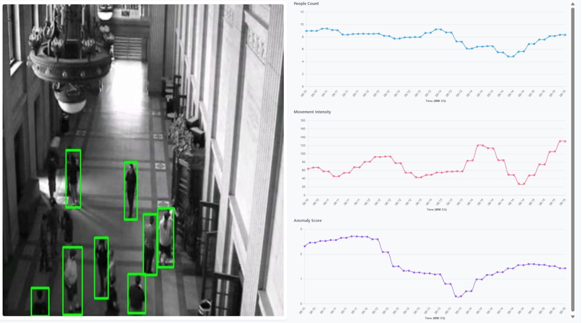
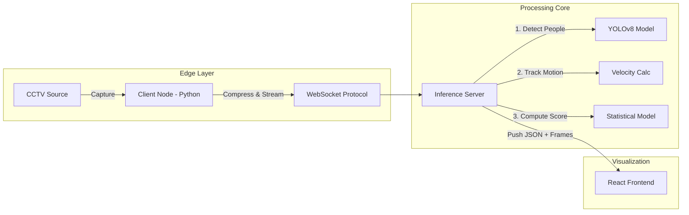

# Crowd Anomaly Detection: Real-Time Surveillance Pipeline

[]()
[]()
[]()

**A distributed computer vision system designed to detect crowd surges, stampedes, and anomalous behavior in real-time.**
Leveraging **YOLOv8** for object detection and **Statistical Velocity Analysis**, this system processes live video feeds with sub-second latency to generate instant alerts for security personnel.



---

## 🏗️ System Architecture

The system follows a **3-Tier Architecture** optimized for low-latency streaming. It decouples the video acquisition (Edge) from the inference engine (Server) to support remote surveillance scenarios.


```mermaid
graph LR
    subgraph "Edge Layer"
        Camera[CCTV Source] -->|Capture| Client[Client Node - Python]
        Client -->|Compress & Stream| WS[WebSocket Protocol]
    end

    subgraph "Processing Core"
        WS --> Server[Inference Server]
        Server -->|1. Detect People| YOLO[YOLOv8 Model]
        Server -->|2. Track Motion| Tracker[Velocity Calc]
        Server -->|3. Compute Score| Anomaly[Statistical Model]
    end

    subgraph "Visualization"
        Server -->|Push JSON + Frames| Dashboard[React Frontend]
    end

```

---

## 🧠 Engineering Challenges & Solutions

### 1. Achieving Real-Time Latency (<100ms)

Transmitting high-resolution video over HTTP introduces massive lag.

* **Solution:** Implemented **Full-Duplex WebSockets** (ws://) for streaming.
* **Optimization:** Frames are resized and JPEG-compressed at the **Edge Node** before transmission, reducing network bandwidth usage by **~60%** while maintaining detection accuracy.

### 2. Differentiating "Motion" from "Panic"

Simple motion detection triggers alerts for walking crowds. We needed to distinguish chaos from varying flow.

* **Solution:** Developed a custom **Root Mean Square (RMS) Velocity Metric**.
* **Logic:** The system tracks the centroid of every detected person across frames. It calculates the aggregate velocity vector of the crowd.
* **Anomaly Logic:** An alert is triggered only if the **current velocity Z-Score** deviates significantly (>2.5σ) from the moving average of the last 30 seconds.

### 3. Edge-Cloud Decoupling

The camera source might be on a low-power device (Raspberry Pi), while the heavy AI inference requires a GPU server.

* **Solution:** The architecture is strictly decoupled. The `Client` script acts as a dumb forwarder, allowing the `Server` to scale independently or run on dedicated hardware (CUDA).

---

## 💻 Technical Stack

| Component | Tech | Role |
| --- | --- | --- |
| **CV Engine** | **YOLOv8 (Nano)** | Object detection optimized for inference speed (FPS). |
| **Analysis** | **OpenCV + NumPy** | Vectorized calculations for crowd density and velocity. |
| **Communication** | **WebSockets (Async)** | Bidirectional real-time data stream (Video + Metrics). |
| **Backend** | **Python (AsyncIO)** | Handles concurrent client connections and model inference. |
| **Frontend** | **React.js + Chart.js** | Live dashboard rendering 30 FPS video canvas and dynamic charts. |

---

## 🚀 Quick Start

### Prerequisites

* Python 3.8+ & Node.js 16+
* Webcam or Video File for testing

### 1. Installation

```bash
git clone [https://github.com/agrpranjal07/crowd-detection.git](https://github.com/agrpranjal07/crowd-detection.git)
cd crowd-detection

# Backend Setup
python -m venv venv
source venv/bin/activate
pip install opencv-python websockets ultralytics numpy scikit-learn

# Frontend Setup
cd react-app
npm install

```

### 2. Execution Strategy

**Step 1: Start the Inference Engine**

```bash
# In Terminal 1
cd server
python server.py
# Server starts at ws://localhost:8765

```

**Step 2: Launch Dashboard**

```bash
# In Terminal 2
cd react-app
npm start
# UI opens at http://localhost:3000

```

**Step 3: Start Edge Capture**

```bash
# In Terminal 3
cd client
# Update VIDEO_PATH in client.py to use '0' for webcam or path to file
python client.py

```

---

## 📊 Analytics Metrics

The system computes three key metrics in real-time:

1. **Crowd Density:** Total distinct humans detected in the frame.
2. **RMS Velocity:** The magnitude of collective movement intensity.
3. **Anomaly Score:** A weighted composite of Density * Velocity. Alerts trigger when this score breaches the dynamic threshold.

---

## 🔮 Future Roadmap

* [ ] **Kalman Filters:** Implement object tracking IDs to persist specific individuals across occlusions.
* [ ] **Deployment:** Dockerize the Server and Edge Client for one-click deployment.
* [ ] **Geo-Fencing:** Allow users to draw "Danger Zones" on the UI to restrict monitoring to specific areas.

---
Open for PRs improving the **Anomaly Algorithm** or **UI Responsiveness**.
